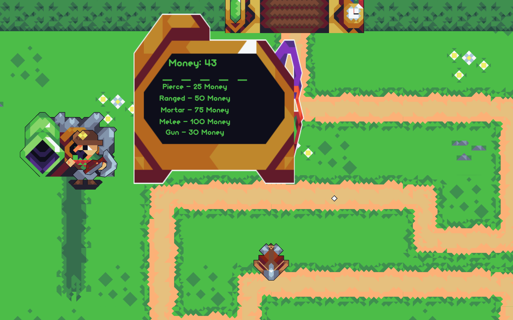
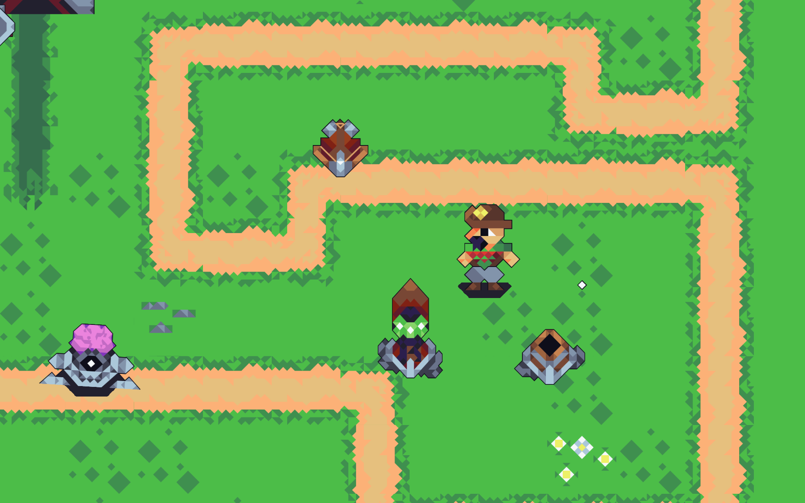
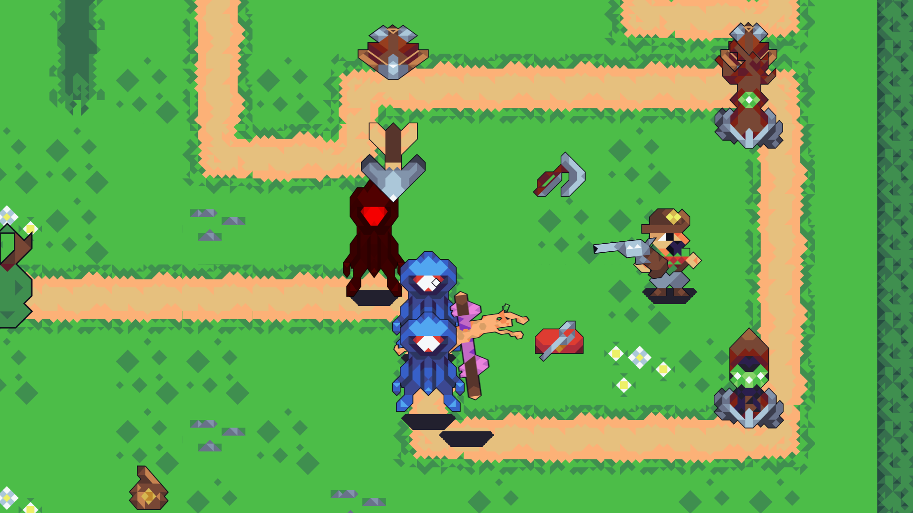

# Sheriff TOWER: Tower Defense 2023

Dit is een Tower defense game gemaakt voor een school opdracht!

Sheriff TOWER is een Tower Defense game waar je niet een nobody bent, maar over het veld loopt om nieuwe towers te plaatsen!
Loop rond het veld, plaats nieuwe torens en upgrade ze om zo ver mogelijk te komen en die mooie hoge rang te halen! 

Ik heb Veel geleerd van dit project. Naast UnityEvents heb ik ook gebruik gemaakt van constructors om makkelijk in de editor te kunnen werken zonder constant in de code te hoeven duiken.
Ik heb al mijn scripts zelf geschreven (en proberen te documenteren (Niet alles is gelukt maar het grootste deel is in het engels gedocumenteerd met comments)) en vond het leuk om te experimenteren met Unity en C# hun functies!

## DRY & SRP

Dit [script](Assets/Scripts/Enviroment/Game_elements/Towers/TowerDetection.cs) Maak ik gebruik van vooral het DRY principe. Ik pak in dit script het meest dichtsbijzijnde vijand en focus op deze door hem in de reference 'lockedEnemy' vast te leggen.
Ik heb dit script in meerdere situaties kunnen toepassen om towers vijanden te laten detecteren, en de meest verre, of dichtsbijzijnde te pakken.

## Projectmappen 

Ik heb in mijn [assets](Assets) folder gebruik gemaakt van een nette mappen structuur, die mischien nog wat werk kan gebruiken maar vrij overzichtelijk is.

## Build

Hier is een [stabiele build](Assets/Builds/Release/SherrifTower_Game_Windows-ver_1.1.zip)
Graag raad ik je aan om ook een kijke te nemen op de itch pagina [hier!](https://tenseven.itch.io/sheriff-tower)

## GIF

## Onepage en Design

Plaats hier een onepage

## Classdiagram

## Gameplay video

Plaats hier een youtube video link van wat gameplay

## SCRUM / Planning

Voor dit project is Trello gebruikt om georganiseerd te blijven, zie hier de [Link naar Trello](https://trello.com/b/Ce2oFOk0/tower-defense).

## Gitflow

Ik heb voor dit project gebruik gemaakt van Gitflow. Ik heb de main branch gebruikt voor mijn stabiele releases gebruikt, waarnaast ik alles heb ontwikkelt op de Development branch. 
Als ik in de toekomst nog aan dit project ga werken zal ik veel experimenteren met wat features op een "Feature" branch.
