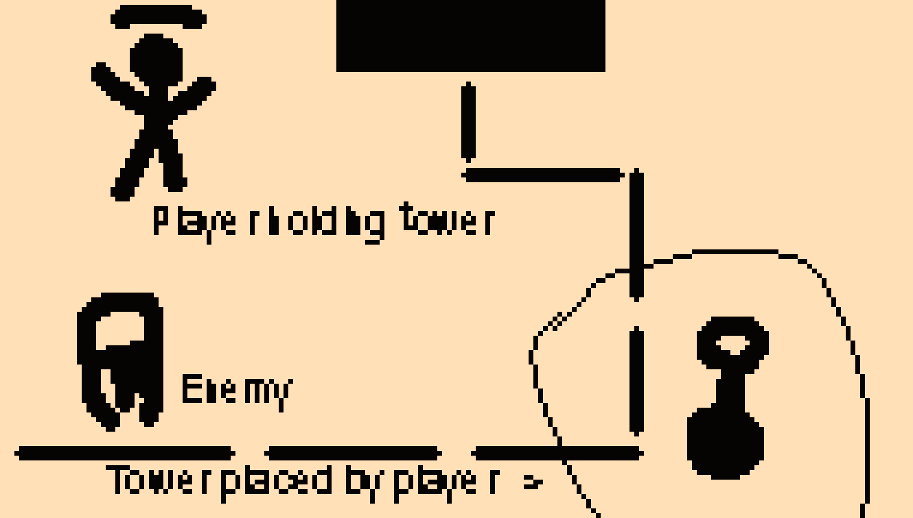

# Sheriff TOWER: Tower Defense 2023

Dit is een Tower defense game gemaakt voor een school opdracht!

Sheriff TOWER is een Tower Defense game waar je niet een nobody bent, maar over het veld loopt om nieuwe towers te plaatsen!
Loop rond het veld, plaats nieuwe torens en upgrade ze om zo ver mogelijk te komen en die mooie hoge rang te halen! 

Ik heb Veel geleerd van dit project. Naast UnityEvents heb ik ook gebruik gemaakt van constructors om makkelijk in de editor te kunnen werken zonder constant in de code te hoeven duiken.
Ik heb al mijn scripts zelf geschreven (en proberen te documenteren (Niet alles is gelukt maar het grootste deel is in het engels gedocumenteerd met comments)) en vond het leuk om te experimenteren met Unity en C# hun functies!

## DRY & SRP

Dit [script](Assets/Scripts/Enviroment/Game_elements/Towers/TowerDetection.cs) Maak ik gebruik van vooral het DRY principe. Ik pak in dit script het meest dichtsbijzijnde vijand en focus op deze door hem in de reference 'lockedEnemy' vast te leggen.
Ik heb dit script in meerdere situaties kunnen toepassen om towers vijanden te laten detecteren, en de meest verre, of dichtsbijzijnde te pakken.

## Projectmappen 

Ik heb in mijn [assets](Assets) folder gebruik gemaakt van een nette mappen structuur, die mischien nog wat werk kan gebruiken maar vrij overzichtelijk is.

## Build

Hier is een [stabiele build](Assets/Builds/Release/SherrifTower_Game_Windows-ver_1.1.zip).
Graag raad ik je aan om ook een kijke te nemen op de itch pagina [hier!](https://tenseven.itch.io/sheriff-tower)

## GIF

## Onepage en Design

**Torens:**

Torens kunnen geplaatst worden op een grid door de speler. De speler koopt deze bij de winkel en kan ze dan oppakken. Torens schieten op de meest verre of meest dichtbijzijnde vijand. Er zijn verschillende torens, elk met zijn eigen manier van aanvallen. Veel torens kunnen volledig 360 graden mikken, maar bijvoorbeeld een ballista schiet in de richting die hij kijkt.

**Winkel en resources:**

Bij de winkel kan de speler torens kopen. De speler klikt op hetgene dat ze willen, en als ze genoeg geld hebben wordt het item (dat kan een toren of iets anders zijn) in gespawnd. Geld wordt verkregen door vijanden te verslaan.

**Vijanden:**

Vijanden volgen een pad naar hun doel. Zodra de vijand zijn doel bereikt richt hij schade aan. Er zijn meerdere vijanden. Zo zijn er vijanden die veel schade kunnen hebben, terwijl er een ander heel snel maar zwak is. Ook is er een vijand die erg veel geld oplevert en ook een die schade aan kan richten aan de speler.

**Wave system:**

Er is een wave systeem die gebruikt maakt van een for loop. Door middel van constructors te gebruiken in een lijst kun je in de editor makkelijk meer waves toevoegen met elk zijn eigen cooldown (tijd tussen enemies die gespawnd worden) en lijst van vijanden. 

**Health en schade:** 

Het doel van de vijanden levert schade op als ze het bereiken. Als het doel geen health meer heeft is het spel voorbij.

**Upgrades:**

Torens kunnen geüpgrade worden. Ook hiervoor gebruik ik een lijst met constructors waar ik stats van torens mee kan verhogen per upgrade. Elke upgrade heeft een prijs en neemt geld af als de speler de upgrade koopt, als de speler genoeg geld heeft.

**Pickup- drop systeem:**

De speler kan wapens, torens en items oppaken en gebruiken. De speler kan items oppakken met de knop *E* en weer laten vallen met dezelfde knop. Als de speler een item vast heeft en een ander item probeert op te pakken, dropt hij zijn huidige item. Torens worden geplaatst als deze gedropt worden.

**Rank en score, replayability:**

Op basis van hoe goed je speelt krijg je een rank. Je rank is op basis van hoever je komt en hoeveel geld je had bij je gameover. Aan het einde van alle waves ben je zoizo game over.

## Classdiagram

## Gameplay video

## SCRUM / Planning

Voor dit project is Trello gebruikt om georganiseerd te blijven, zie hier de [Link naar Trello](https://trello.com/b/Ce2oFOk0/tower-defense).

## Gitflow

Ik heb voor dit project gebruik gemaakt van Gitflow. Ik heb de main branch gebruikt voor mijn stabiele releases gebruikt, waarnaast ik alles heb ontwikkelt op de Development branch. 
Als ik in de toekomst nog aan dit project ga werken zal ik veel experimenteren met wat features op een "Feature" branch.
